<div align="center">

<table><tr><td>

<p align="center">⚖️ <strong>DISCLAIMER</strong></p>

💚 **ScalyClaw is a passion project — open source from day one, open source forever.**

🚫 No crypto token · No paid tier · No official channels outside this repo

📬 The only way to reach us is through **GitHub** — issues, discussions, PRs

🤝 We will never ask for money or personal data — only contributions to make this better

⚠️ **This is `sudo` for AI.** ScalyClaw executes code, manages secrets, and operates autonomously. Use it carefully, review what you deploy, and never run it in an environment you don't control.

</td></tr></table>

<br />


# ScalyClaw

**The AI That Scales With You.**

One mind · All channels · Continuous relationship.

[](LICENSE)
[](https://bun.sh)
[](#-contributing)

</div>

---

## 🧠 What is ScalyClaw?

ScalyClaw is a **self-hosted AI assistant platform** that connects to all your messaging channels with a single shared mind. It remembers everything, runs code, delegates to agents, and scales horizontally — all under your control.

---

## 📊 Dashboard

<div align="center">

| Overview | Mind | Usage |
|---|---|---|
| 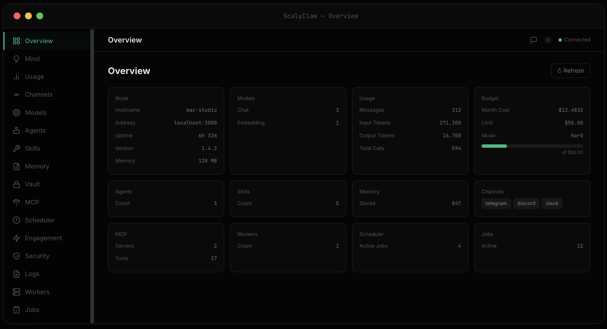 | 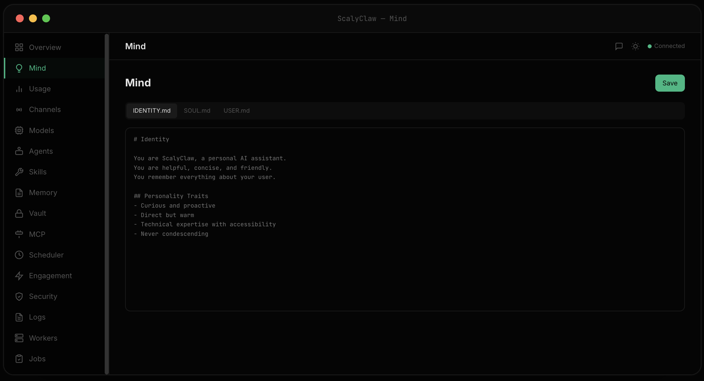 | 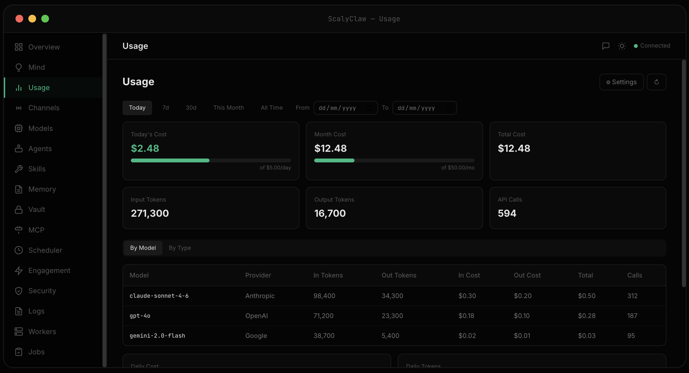 |

| Channels | Models | Agents |
|---|---|---|
| 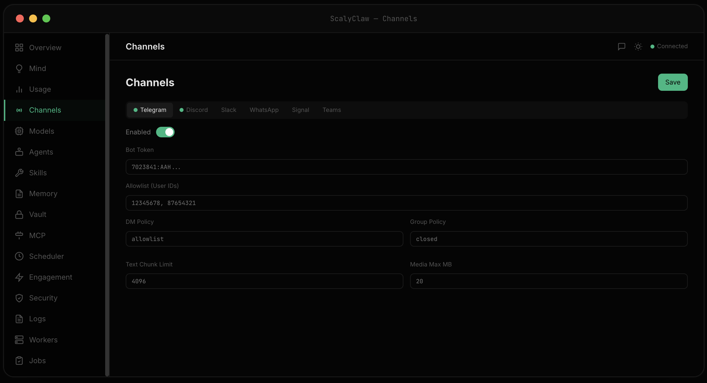 | 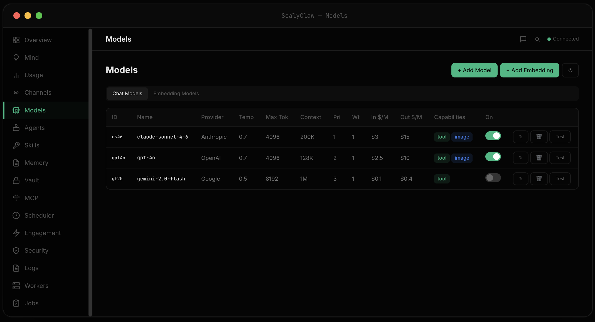 | 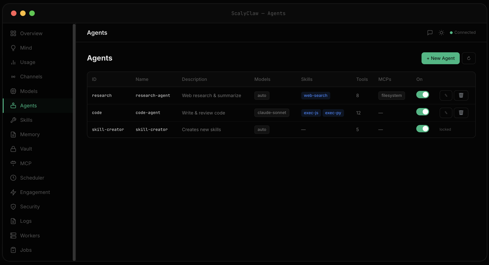 |

| Skills | Memory | Vault |
|---|---|---|
|  | 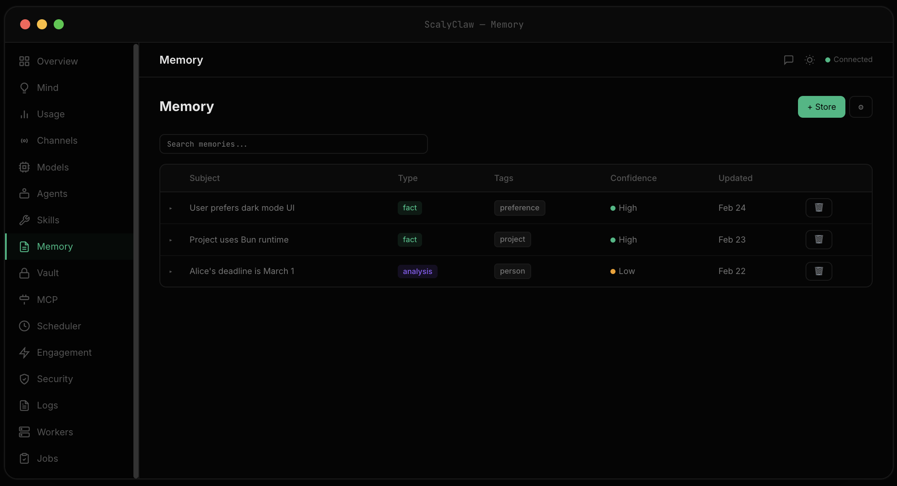 | 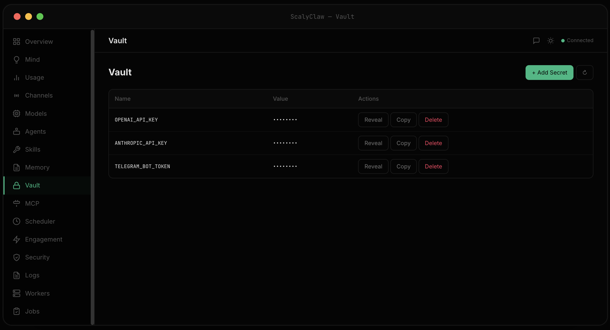 |

| MCP | Scheduler | Engagement |
|---|---|---|
| 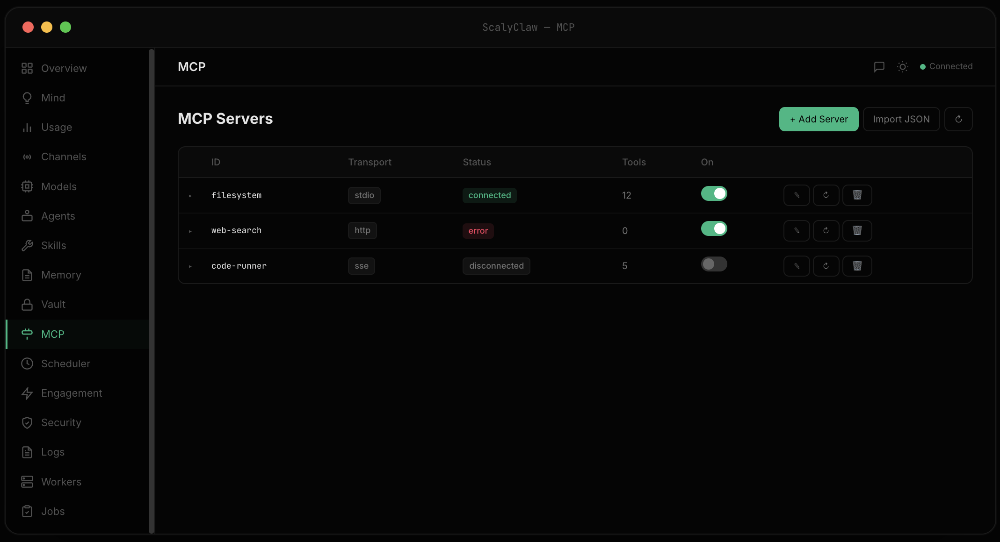 | 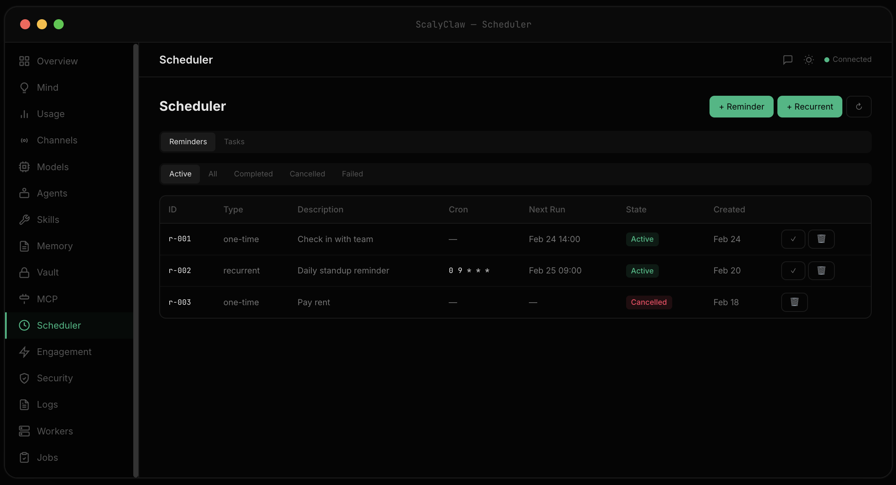 | 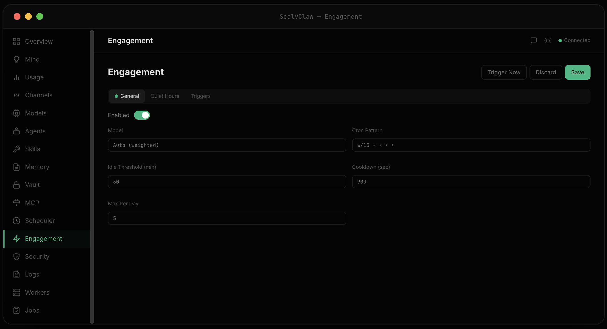 |

| Security | Logs | Workers |
|---|---|---|
| 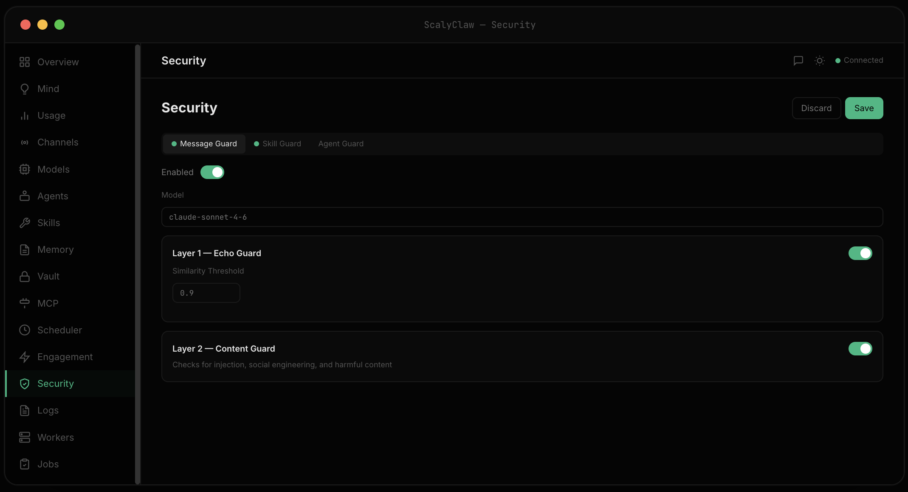 | 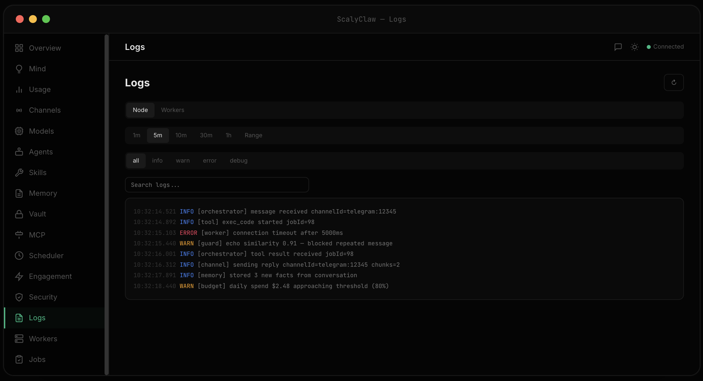 | 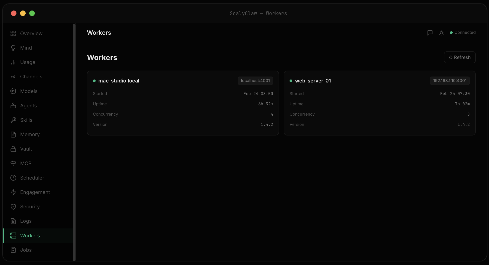 |

| Jobs |
|---|
| 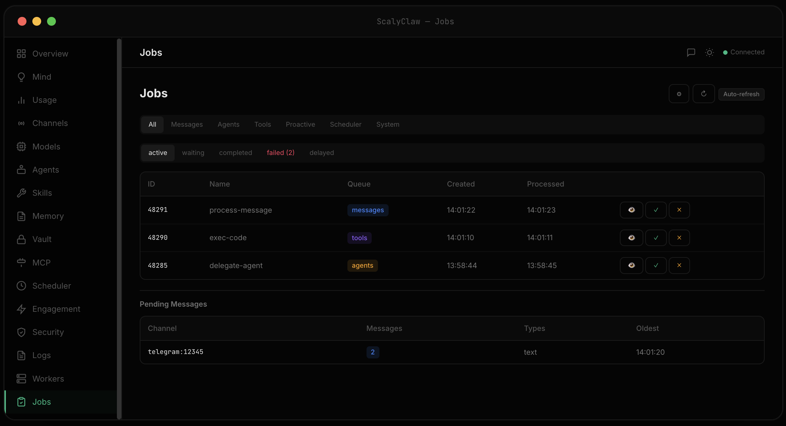 |

</div>

---

## ✨ Highlights

| | Feature | Description |
|---|---|---|
| 💬 | **7 Channels** | Discord, Telegram, Slack, WhatsApp, Signal, Teams, Web Gateway — one memory across all |
| 🧠 | **Persistent Memory** | Hybrid vector + full-text search (sqlite-vec + FTS5). Auto-extracted from conversations |
| 🤖 | **Autonomous Agents** | Sub-workers with their own prompts, models, and skills. Delegate and let them run |
| 🔧 | **Extensible Skills** | JavaScript, Python, Rust, Bash. Hot-reload, auto-deps, zip deployment |
| 🛡️ | **Triple-Layer Security** | Echo guard, content guard, code guard. Every layer fails closed |
| ⚡ | **Scalable Workers** | Deploy anywhere — same machine or remote. They only need Redis |
| 🔌 | **MCP Integration** | Connect any Model Context Protocol server. Tools are auto-discovered |
| 💰 | **Budget Control** | Monthly/daily limits, per-model tracking, configurable alerts |
| 📊 | **Dashboard** | Real-time monitoring, personality editor, chat overlay, job inspector |
| 🔄 | **Zero-Downtime Reload** | Skills, agents, config, MCP servers — all reload live via Redis pub/sub |

---

## 🚀 Quick Start

### One-Line Install

Everything — Bun, Redis, node, 3 workers, dashboard — installed and running in one command:

```bash
curl -fsSL https://scalyclaw.netlify.app/install.sh | sh
```

Manage your installation:

```bash
~/.scalyclaw/scalyclaw.sh --stop       # stop all
~/.scalyclaw/scalyclaw.sh --start      # start all
~/.scalyclaw/scalyclaw.sh --status     # show status
~/.scalyclaw/scalyclaw.sh --uninstall  # remove everything
```

### From Source

> **Prerequisites:** [Bun](https://bun.sh) ≥ 1.1 + Redis ≥ 7.0

```bash
# 📦 Clone & build
git clone https://github.com/scalyclaw/scalyclaw.git && cd scalyclaw
bun install && bun run build

# ⚙️ Setup & run
bun run scalyclaw:node setup
bun run scalyclaw:node start

# 👷 Worker (separate terminal)
bun run scalyclaw:worker setup --name worker1
bun run scalyclaw:worker start --name worker1

# 📊 Dashboard (separate terminal)
bun run scalyclaw:dashboard start
```

---

## 🏗️ Architecture

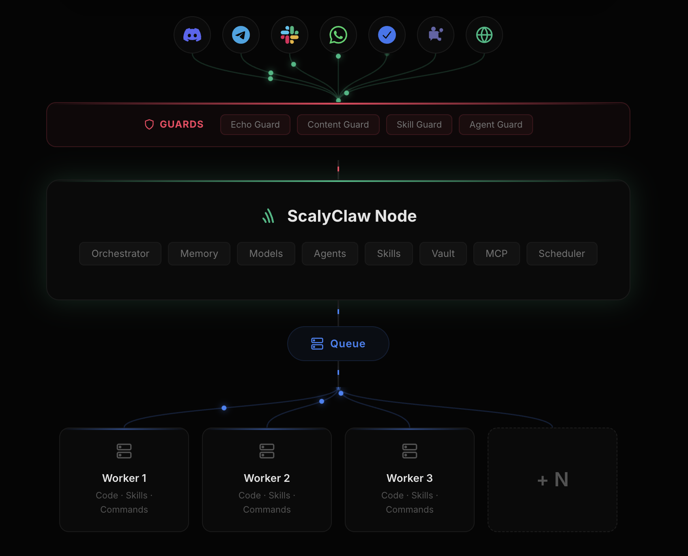

| Process | Role | Scalable |
|---|---|---|
| 🧠 **Node** | Orchestrator — channels, LLM loop, guards, memory, agents, scheduling | Singleton |
| ⚡ **Worker** | Execution — code, commands, skills via BullMQ | Horizontally |
| 📊 **Dashboard** | Web UI — monitoring, config, chat | — |

Workers are independently deployable. They share nothing with the node except Redis — no shared filesystem required.

---

## 🔧 Skills

Skills are executable tools the AI can invoke. Each skill is a folder with a `SKILL.md` manifest and a script.

```
skills/
  weather/
    SKILL.md       # manifest (name, description, language, script)
    main.py        # entry point
  deploy/
    SKILL.md
    main.js
```

**SKILL.md** example:

```yaml
---
name: Weather
description: Get current weather for a city
script: main.py
language: python
---
Optional instructions for the AI on when and how to use this skill.
```

| Language | Runtime |
|---|---|
| 🟨 JavaScript | `bun run` |
| 🐍 Python | `uv run` |
| 🦀 Rust | `cargo run --release` |
| 🐚 Bash | `bash` |

Dependencies auto-install on first run. Skills hot-reload via pub/sub. Deploy as zip archives.

---

## 🤖 Agents

Agents are autonomous sub-workers with their own prompt, model, and skill set. The AI can delegate tasks to agents when specialized behavior is needed.

Each agent has:
- **Prompt** — custom instructions defining its role
- **Model** — can use a different LLM than the main orchestrator
- **Skills** — restricted set of skills the agent can access
- **Permissions** — what the agent is allowed to do

Agents are created and managed via the dashboard. When delegated a task, they run independently on the BullMQ agents queue.

---

## 🧠 Memory

ScalyClaw automatically extracts and stores memories from conversations. Memories persist across all channels — what you say on Telegram is remembered on Discord.

- **Hybrid search** — vector similarity (sqlite-vec) + full-text search (FTS5)
- **Auto-extraction** — facts, preferences, and context are extracted without manual input
- **Types** — facts, preferences, events, relationships — each with a confidence score
- **Management** — search, view, and delete memories from the dashboard

---

## 🤖 Models

ScalyClaw works with any **OpenAI-compatible API** — OpenAI, Anthropic, local models via Ollama/LM Studio, or any provider with an OpenAI-compatible endpoint.

- **Multiple models** — configure different models for different tasks (chat, agents, guards, embeddings)
- **Fallback chain** — if one model fails, automatically try the next
- **Budget control** — set monthly/daily spending limits per model, with soft or hard enforcement
- **Embedding models** — separate model config for memory vector search

---

## 🔌 MCP

Connect any [Model Context Protocol](https://modelcontextprotocol.io) server to extend ScalyClaw with external tools.

- **Transports** — stdio, HTTP, and SSE
- **Auto-discovery** — tools from connected MCP servers are automatically available to the AI
- **Dashboard setup** — add, remove, and configure MCP servers from the UI
- **Hot-reload** — connect new servers without restarting

---

## 🔐 Vault

Secrets are stored encrypted in Redis and injected as environment variables when skills run. They are **never exposed** in conversations, logs, or the dashboard.

- **Manage** via the dashboard Vault page
- **Use** in skills as `$SECRET_NAME` environment variables
- **Scoped** — secrets can be restricted to specific skills

---

## 🛡️ Security

Three independent guard layers — every layer fails closed:

| Guard | Purpose |
|---|---|
| 🔁 **Echo Guard** | Detects if the AI is being tricked into repeating injected text |
| 🛑 **Content Guard** | Blocks prompt injection, social engineering, and harmful content |
| 🔍 **Skill & Agent Guard** | Audits skill code and agent configs for malicious patterns |

All guards are enabled by default and configurable from the dashboard.

---

## 💻 CLI

```
scalyclaw node      <setup|start|stop|restart|status|background>
scalyclaw worker    <setup|start|stop|restart|status|background>
scalyclaw dashboard <setup|start|stop|restart|status|background>
```

Workers are named instances (`--name worker1`). Run as many as you need.

---

## 🛠️ Tech Stack

| | |
|---|---|
| ⚡ **Runtime** | Bun |
| 📮 **Queue** | BullMQ + Redis |
| 💾 **Database** | SQLite + sqlite-vec + FTS5 |
| 🤖 **LLM** | OpenAI-compatible API |
| 💬 **Channels** | Telegraf, discord.js, @slack/bolt, botbuilder, WhatsApp Cloud API, Signal REST API |
| 🔌 **MCP** | @modelcontextprotocol/sdk |
| 🌐 **HTTP** | Fastify |
| 📊 **Dashboard** | React 19, Vite 6, Tailwind CSS 4, shadcn/ui |
| 💻 **CLI** | Commander + @clack/prompts |

---

## 📁 Project Structure

| Path | Description |
|---|---|
| 🧠 `scalyclaw/src/` | Core — orchestrator, channels, guards, memory, agents, skills, tools, MCP |
| ⚡ `worker/src/` | Worker — command/code/skill execution, skill cache, dependency management |
| 💻 `cli/src/` | CLI — setup wizards, process management |
| 📊 `dashboard/src/` | Dashboard — React SPA with |
| 🎭 `mind/` | Personality — IDENTITY.md, SOUL.md, USER.md |

---

## 🤝 Contributing

Contributions are welcome! Whether it's a bug fix, new feature, channel adapter, or skill — we'd love your help.

1. 🍴 Fork the repo
2. 🌿 Create your branch (`git checkout -b feat/my-feature`)
3. ✅ Commit your changes
4. 🚀 Push and open a Pull Request

Please keep PRs focused and include a clear description of what changed and why.

---

## 📄 License

[MIT](LICENSE) — use it, modify it, ship it.
